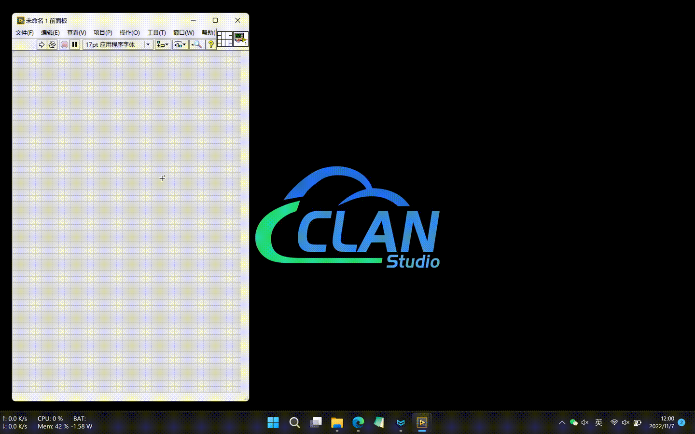
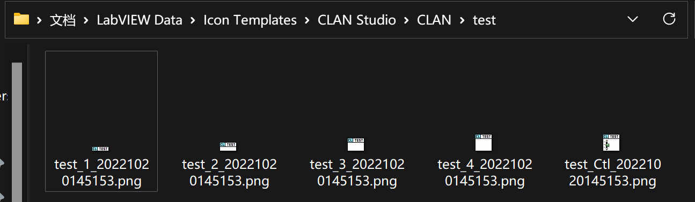
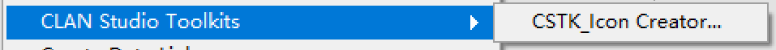
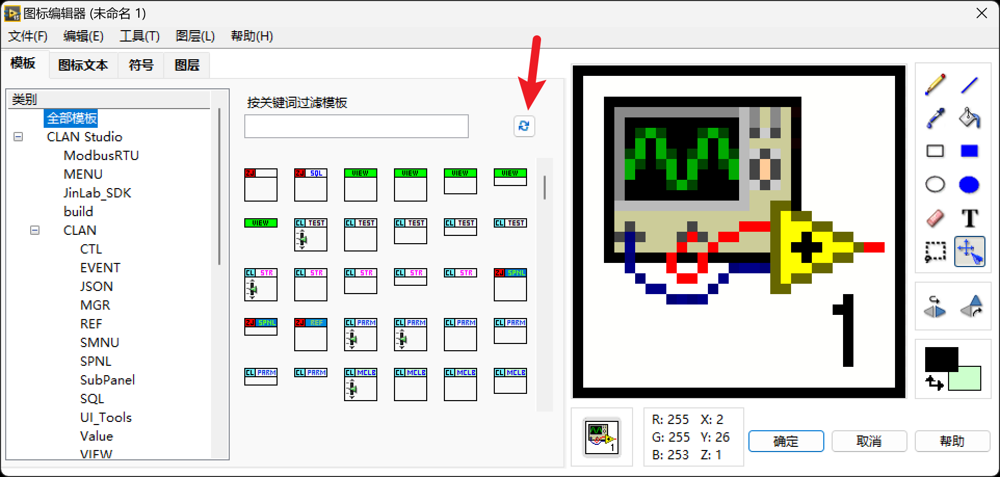
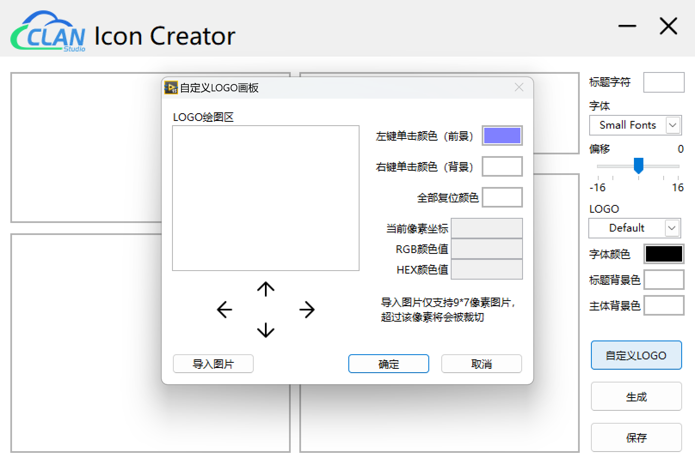

# CLAN Studio Toolkits - Icon Creator

仓库地址：[CSTK_Icon_Creator](https://github.com/clan4456/CSTK_Icon_Creator)

下载地址：[clan_studio_lib_cstk_icon_creator-1.0.0.3.vip](https://github.com/clan4456/CSTK_Icon_Creator/releases/download/v1.0.0.3/clan_studio_lib_cstk_icon_creator-1.0.0.3.vip)

SHA-256：2c51600e15e231155ff5b91ff82a91762ed9329b28fe34f2522e5441a3bdb87e

## 1. 简介



本工具主要用于生成规范化图标模板，左上角为可配置的自定义标志，右上角为图标模板标题，无标志情况下支持7个字符，有标志情况下支持5个字符。标题字体可选择 Small Fonts 或 6px2bus 。 Small Fonts 为 LabVIEW 开发环境安装时自带， 6px2bus 字体安装方式详见下文。标题字体颜色、标题背景颜色、主题背景颜色均可自定义。

设置完毕后，点击“生成”按钮可预览图标，预览后再点击“保存”按钮，自动保存。图标模板保存路径为`%USERPROFILE%\Documents\LabVIEW Data\Icon Templates\CLAN Studio\`中，按自定义标志分类。

保存的图标模板一共5个，其中通用模板4个（1~4），控件模板1个（Ctl）。



## 2. 前置库

本工具使用以下的OpenG库，需通过VIPM提前安装，也可在安装本工具时自动安装，同时也可下载本仓库中的前置库离线安装包 [CSTK_Icon_Creator.vipc](CSTK_Icon_Creator.vipc) 。

- OpenG File Library >= 4.0.1.22
- OpenG Array Library >= 4.1.1.14
- OpenG Variant Data Library >= 5.0.0.27
- OpenG String Library >= 5.0.0.25
- OpenG Error Library >= 4.2.0.23
- OpenG Application Control Library >= 4.1.0.7

## 3. 字体安装

下载本仓库Fonts文件夹中的`6PX2BUS_symbol.ttf`字体，并右击，选择“ ***为所有用户安装*** ”。

## 4. Small Fonts字体清晰度调整

用记事本打开LabVIEW程序安装目录下的“LabVIEW.ini”配置文件，在末尾增加以下一行，并保存。

```ini
FontCodePageList=Small Fonts,1252
```

## 5. 安装Icon Creator

下载Release中的`clan_studio_lib_cstk_icon_creator-1.0.0.3.vip`，并双击通过VIPM进行安装。（需安装VIPM 2017或以上版本）

## 6. 打开Icon Creator



安装 ***Icon Creator*** 后，可通过LabVIEW的“工具”-->“CLAN Studio Toolkits”-->“CSTK_Icon_Creator”打开。

## 7. 使用图标模板

在生成并保存图标模板后，只需打开图标编辑器，点击“模板”中的刷新按钮，即可看到刚才生成的图标模板。



## 8. 自定义标志



从v1.0.0.2版本起，本工具支持直接绘制自定义LOGO标志，可通过点击右下角`自定义LOGO`按钮，弹出自定义LOGO画板进行绘制。

该画板可绘制9*7像素的自定义LOGO，可通过左键单击或右键单击/拖动来绘制不同颜色的像素点。通过4个方向箭头按钮，可调整绘制图形的位置。

该画板同时支持导入图片，但仅支持9*7像素图片，超过该尺寸将会被裁切。

## 9. 已知bug

- `[v1.0.0.3 已修复]` 创建自定义LOGO标志，保存给空值时没做错误处理，导致保存出错卡死。（感谢群友 `🐜红颜妃子笑🐜` 和 `三多` 反馈此bug）

## 10. 开源许可

本工具遵循BSD开源协议，可任意分发或二次开发使用。但需保留UI界面上的CLAN Studio标志即可。

## 11. 更新记录

### v1.0.0.3_20230401

- fix bug: 创建自定义LOGO标志，保存给空值时没做错误处理，导致保存出错卡死。

### v1.0.0.2_20221107

- 增加LOGO自定义绘图板

- 修改Icon模板机制
